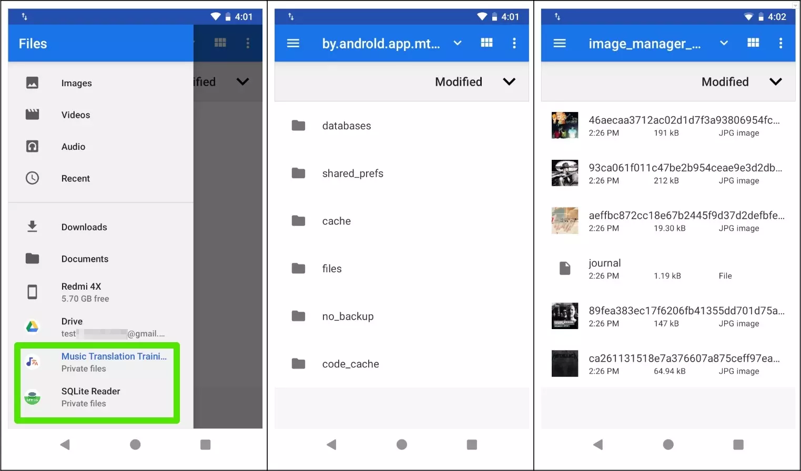

# privatefiles
[](https://jitpack.io/#RomanTsarou/privatefiles)
[](http://www.apache.org/licenses/LICENSE-2.0)



privatefiles allow developers to easily access the private files of your apps, such as shared_preferences, databases, cached images, etc.

## Setup

Add the dependency in your `build.gradle` file:

```gradle
repositories {
    maven { url "https://jitpack.io" }
}

 dependencies {
   debugImplementation 'com.github.RomanTsarou:privatefiles:1.0.1'
 }
```
